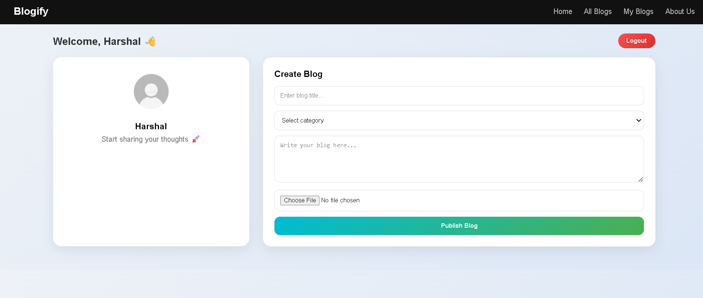
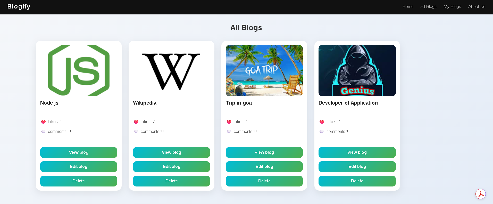
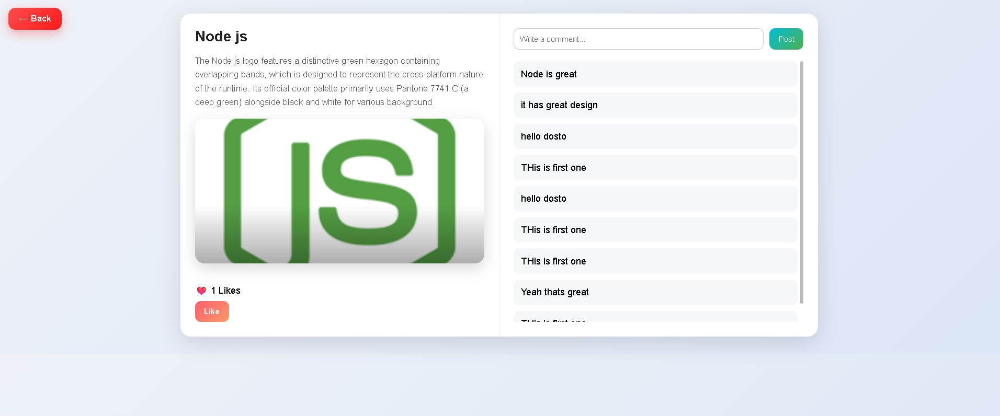
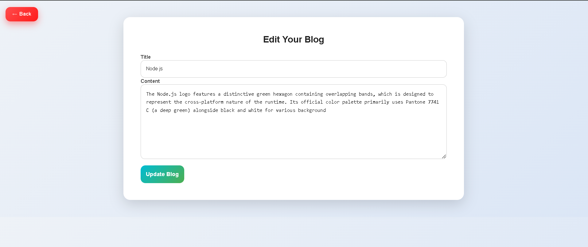

**Blogify**
A fully functional backend for a blogging application built with Node.js, Express, and MongoDB, supporting authentication, authorization, and interactive features like likes and comments.
## 🚀 Features

### 🔐 Authentication & Authorization

* User Signup & Login
* Secure password hashing using bcrypt
* JWT-based authentication (JSON Web Token)
* Role-based access control (User & Admin)
* Admin can manage all blogs
* Users can only edit/delete their own blogs

---

### 📝 Blog Management (CRUD)

* Create new blogs
* View all blogs
* View individual blog details
* View user-specific blogs
* Edit existing blogs
* Delete blogs

---

### 🔍 Search & Filtering 

* Search blogs by title using MongoDB text index
* Filter blogs by category (Travel, Tech, Food, Lifestyle)
* Combined filtering (Search + Category together)
* Dynamic query building in backend
* Clean and responsive UI for filters and search

---

### 💬 Interaction Features

* Like / Unlike blogs
* Comment on blogs
* View all comments on each blog

---

### 🛡️ Security & Access Control

* Protected routes using middleware
* Authorization checks for sensitive actions (edit/delete)
* Clean and structured backend architecture

### ⚙️ Tech Stack

* **Backend:** Node.js, Express.js
* **Database:** MongoDB
* **Authentication:** JWT (JSON Web Token)
* **Password Security:** bcrypt

Project Structure - 

├── controllers
├── models
├── routes
├── middlewares
├── config
├── app.js / server.js

## 📸 Screenshots

## 🎥 Demo

### Signup API

### Create Blog

### All blog Feature

### View blog Feature

### Edit blog Feature

**Installation & Setup**

1. Clone the repository
 
git clone https://github.com/Harshal135701/Blogify.git

2. Install dependencies

npm install

3. Setup environment variables

Create a .env file

PORT=5000
MONGO_URI=your_mongodb_connection_string
JWT_SECRET=your_secret_key

4. Run the server
npm start

**What I Learned**

- Building REST APIs from scratch
- Implementing authentication & authorization
- Designing scalable backend structure
- Handling real-world features like likes & comments
- Writing clean and modular code

**Future Improvements**

- Pagination & Search
- Image upload (Cloud storage)
- Rate limiting & security enhancements
- Deployment with Nginx

**Author**

Harshal Borse